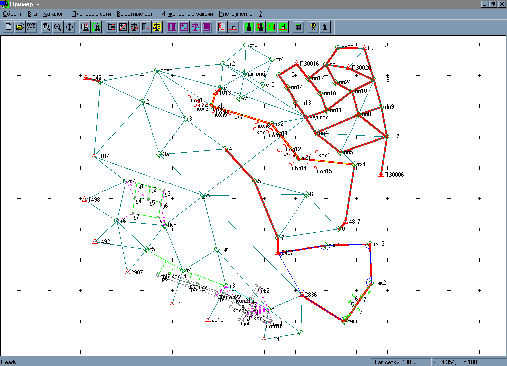
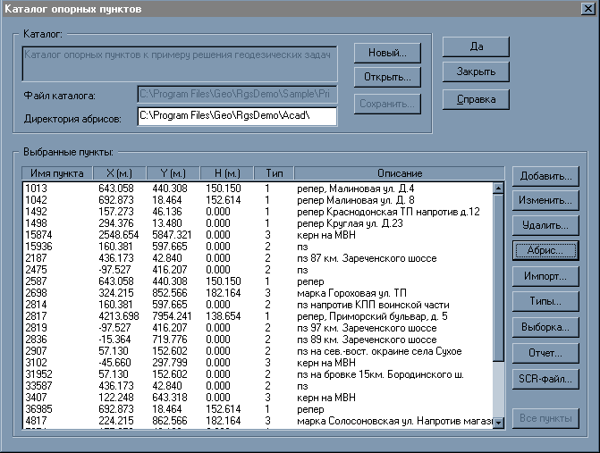

# RGS system (demo)

Geodetic networks adjustment system.  
Contains a complete list of geodetic tasks.  
Has an external offline cataloger.

---

URL: https://github.com/Geo-Linux-Calculations/rgs-demo-exe
